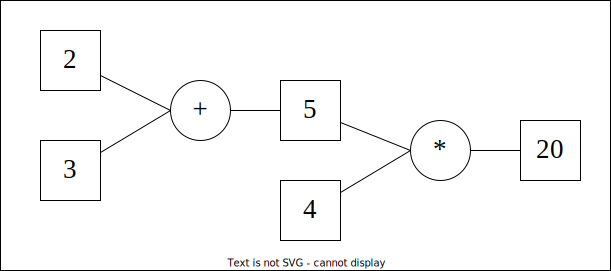
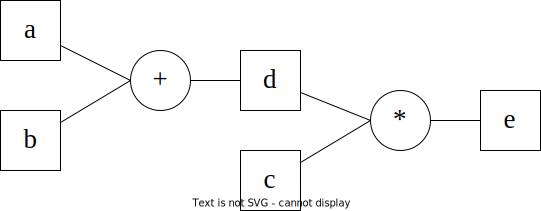
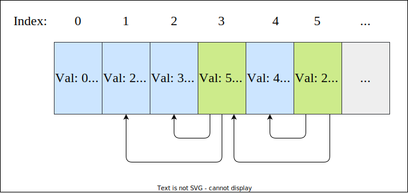
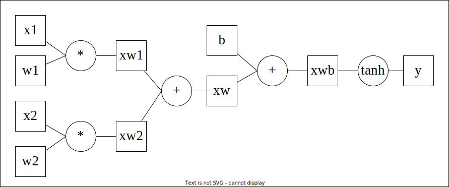

# Simple Automatic Differentiation library

This repository contains the implementation of scalar-valued reverse mode `autodiff` written in the C language. I implemented autodiff in C for educational and recreational purposes. Languages that offer operator overloading and a garbage collector would be ideal for an autodiff implementation. Nonetheless, implementing autodiff in C allowed for many interesting implementation details, such as the use of a flattened directed acyclic graph which is sometimes referred to as `relative pointers`.

## What is `autodiff`?
Automatic differentiation (or simply `autodiff`) is the key method used by sophisticated deep learning libraries (e.g. Pytorch and Tensorflow) to garner the gradients of arbitrary computations. The gradients are then used to perform backpropagation through an artificial neural network model. The key difference between this implementation and that of Pytorch or Tensorflow is that this implementation considers gradients of scalar values, while Pytorch/Tensorflow operate on multi-dimensional arrays, and thus consider gradients of tensor values. As opposed to other methods for computing gradients, the strength of autodiff lies in accuracy and simplicity to implement. We can distinguish two variants of autodiff, forward mode and reverse mode. This repository is concerned with the reverse mode autodiff, which means that the derivative of a result with respect to its inputs is obtained by starting at the result and propagating the gradient backwards through previous computations.  

Generally, we are used to computing gradients based on differentiating the symbolic expression of a function $f(x)$ to another expression that is the derivative of $f$. For instance, $f(x) = x^2$ can be differentiated, which results in $f'(x) = 2x$. Symbolically parsing and transforming functions into its derivative is not scalable as the functions grow in size. Take for instance a moderately sized neural network, which consists of possibly hundreds of function compositions that would result in a massive symbolic expression. The derivative of which is not feasable to compute using symbolic differentiation. Thus, this approach is rejected for computing gradients. 

Another method that we can use is the limit definition of the derivative. That is, the following limit.

$$
    \lim_{h \to 0} \frac{f(x + h) - f(x)}{h}
$$

This is very easy to compute. We just choose a small value for `h` and plug it into the formula. However, this will not be accurate as we are limited to the finite size of floating point values. As an example. let $f(x) = x^2$ and let $x = 3$. The following table depicts derivative calculations with decreasing values for $h$ using the limit definition of the derivative. 

|$h$ | $df / dx$ |
|---|---------|
|$0.1$       |$6.100000000000012$|
|$0.01$      |$6.009999999999849$|
|$0.0001$    |$6.000100000012054$|
|$0.0000001$ |$6.000000087880153$|
|$0.000000001$ |$6.000000087880153$|

We know that the derivative of $f$ is $f'(x) = 2x$ and $f'(3) = 6$. Therefore, we can see from the table that the value converges as $h$ tends to 0. However, using this method, convergence with limited 32 or 64 bit floats is difficult, and thus, this method is rejected for optimal differentiation.

At last, consider automatic differentiation, which is neither symbolic differentiation nor uses the limit definition. Rather, it uses the elementary building blocks of simple mathematical expressions and chains them together using the **chain rule** of calculus. Consider the simple expression $x = (2 + 3) * 4$, which can be destructured into 2 separate computations, i.e., $a = 2+3$ and $x = a * 4$. We can construct a binary tree for the computation associated with $x$. 



The method of reverse mode automatic differentiation starts at the result, in this case $20$, and we compute each local derivative with respect to the child nodes, which are $5$ and $4$ using the multiplication rule of calculus. These are often very easy calculations, such as for addition and multiplication. Thereafter, we use the chain rule and multiply and add the local derivatives to obtain the global derivative with respect to some input. We set the gradients of the children using this computation and perform the same algorithm recursively until we have walked the entire graph. The result is a **computation graph** where each node has a gradient that was calculated with respect to the output of the computation. 



We can encode custom functions to differentiate simple additions, multiplications, and any other computation (this is not limited to only mathematical computations) and use the chain rule to derive the derivative of the output with respect to every possible node in the graph. The reverse mode method starts at the end of the computation, i.e., at the result, and propagates the gradients backwards towards the beginning. 

In the above example, it is easy to compute the local derivatives of the computations. Starting at node `e`, the derivative of `e` with respect to (w.r.t.) `e` is just 1. Looking at the children of `e`, we have `d` and `c`. The derivative of `e` w.r.t. `c` is `d`, since `e = d * c`. And the derivative of `e` w.r.t. `d` is `c`, since `e = d * c`. Now `d` also has children, so let's compute the derivatives. The derivative of `d` w.r.t. `a` and w.r.t. `b` is 1, since `d = a + b`. Up until now, we have computed the local derivatives. Using the chain rule we can multiply the local derivatives to obtain the global derivatives with respect to the inputs `a` and `b`. Mathematics has a nice way to formulate this notion using the partial form ($\partial$).

$$
    \frac{\partial e}{\partial a} = \frac{\partial e}{\partial d} \cdot \frac{\partial d}{\partial a} \qquad \text{and} \qquad \frac{\partial e}{\partial b} = \frac{\partial e}{\partial d} \cdot \frac{\partial d}{\partial b}
$$

## Implementation details

The library consists of two files, `autodiff.c` and `autodiff.h`. Since the computation graph is a **graph**, and not a tree structure even though it might look like a tree, it is possible that the graph contains cycles. Therefore, simply wrapping floating point values in a struct and using this wrapper as nodes in a linked-list is not enough. Furthermore, for each value and each result in a computation, we would need to allocate space in virtual memory. This can cause severe memory fragmentation as the allocations are always small, i.e., a couple bytes in size. To counteract this issue, the library uses a simple dynamic array and relative pointers that index into this array. The structure that acts as a dynamic array and maintains all value nodes is the `Tape` structure. Sophisticated machine learning libraries such as Pytorch and Tensorflow also use a tape object, although I am not sure if their approach also uses relative pointers. Consider the following schematic depicting the tape for the computation of $(2+3) * 4$. 



The first element is the **nil** element. It is analogous to the `NULL` value for a child pointer of a standard linked list. Here, the elements at indices 1, 2, and 4 all have 0 as the left (L) and right (R) pointers, which sends them back to the **nil** element at index 0. The indices 3 and 5 are a result of a computation. Their value is dependent on the operation used (Op) and the left and right relative pointers. Furthermore, observe that the graph is encoded into a dynamic array structure. Memory is managed easily as a singular tape containing all values during computations, and instead of fragmenting the memory, entire chunks of memory need only be reallocated when expanding the dynamic array. 

To achieve this in code, consider the following snippet. 

```C
int main(void){

    // initialise the tape
    Tape tp = {0};
    ad_init_tape(&tp);

    // perform computations
    size_t a = ad_create(&tp, 2.0f);
    size_t b = ad_create(&tp, 3.0f);
    size_t c = ad_add(&tp, a, b);
    size_t d = ad_create(&tp, 4.0f);

    size_t result = ad_mul(&tp, c, d);

    // print tape content
    ad_print_tape(&tp);

    // free tape
    ad_destroy_tape(&tp);
    return 0;
}
```

the `ad_print_tape(&tp)` function prints the following to the console.

```C
val:  0, index:   0, left:   0, right:   0, op: add 
val:  2, index:   1, left:   0, right:   0, op: nil
val:  3, index:   2, left:   0, right:   0, op: nil
val:  5, index:   3, left:   1, right:   2, op: add
val:  4, index:   4, left:   0, right:   0, op: nil
val: 20, index:   5, left:   3, right:   4, op: mul
```

If we want to compute the gradients of the expression `(2+3) * 4`, we can add the `ad_reverse(&tp, result)` function that computes the gradients using reverse mode autodiff. Consider the following snippet. 

```C
int main(void){

    // initialise the tape
    Tape tp = {0};
    ad_init_tape(&tp);

    // perform computations
    size_t a = ad_create(&tp, 2.0f);
    size_t b = ad_create(&tp, 3.0f);
    size_t c = ad_add(&tp, a, b);
    size_t d = ad_create(&tp, 4.0f);

    size_t result = ad_mul(&tp, c, d);

    // differentiate result w.r.t. a b c and d
    ad_reverse(&tp, result);
    // print computation tree
    ad_print_tree(&tp, result);

    // free tape
    ad_destroy_tape(&tp);
    return 0;
}
    
```
```C
------------- Computation graph -------------
[mul ] node (data: 20, grad: 1)
    [add ] node (data: 5, grad: 4)
        [nil] node (data: 2, grad: 4)
        [nil] node (data: 3, grad: 4)
    [nil] node (data: 4, grad: 5)
--------------------------------------------
```

The API of the `autodiff` library following consists of the following functions. 
Consider the memory management functions and the reverse mode function:
- `ad_init_tape(Tape* tape)`: initialises the dynamic array (tape) for use. 
- `ad_destroy_tape(Tape* tape)`: destroys the dynamic array (tape).
- `ad_reverse(Tape* tp, size_t y)`: computes the gradients of every value that is connected to the graph of `y` with respect to `y` and propagates the gradients using the chain rule.
- `ad_reverse_toposort(Tape* tp, size_t y)`: Before computing the gradients of the computation graph, the nodes are first topologically sorted, which means that the children of a node are first considered before their parent is considered. Traversing the computation graph in topological reverse order ensures that every node is visited exactly once. This is only needed when the internal structure of the tape is manipulated. Otherwise, use the `ad_reverse(Tape* tp, size_t y)` function. 
  
Consider the arithmatic functions:
- `ad_create(Tape* tp, float value)`: creates a value on the tape.
- `ad_add(Tape* tp, size_t a, size_t b)`: creates a value on the tape based on the addition of two values on the tape pointed to by index. 
- `ad_sub(Tape* tp, size_t a, size_t b)`: creates a value on the tape based on the subtraction of two values on the tape pointed to by index. 
- `ad_mul(Tape* tp, size_t a, size_t b)`: creates a value on the tape based on the multiplication of two values on the tape pointed to by index. 
- `ad_pow(Tape* tp, size_t a, size_t b)`: creates a value on the tape based on the exponentiation of two values on the tape pointed to by index.

Consider some common activation functions:
- `ad_tanh(Tape* tp, size_t a)`: creates a value on the tape based on the `tanh(x)` function.
- `ad_relu(Tape* tp, size_t a)`: creates a value on the tape based on the `ReLu(x)` function.
- `ad_sigm(Tape* tp, size_t a)`: creates a value on the tape based on the `sigmoid(x)` function.

Consider the debugging functions:
- `ad_print_tape(Tape* tp)`: prints the contents of the tape array.
- `ad_print_tree(Tape* tp, size_t y)`: print the computation graph of `y`.

## Usage
The build system is `make` and there are no external dependencies. The implementation of autodiff is contained in `autodiff.c` and `autodiff.h`. Run the following for a demo example.
```
$ make 
$ ./autodiff
```
A more sophisticated example is also included, in which a simple multi-layer perceptron is used to solve the `XOR` problem. The code for this example can be found in `examples/mlp.c`. 
```
$ make mlp_example
$ ./mlp_demo
.
.
.
Average loss: 0.000727057
Average loss: 0.000726102
Average loss: 0.000725149
...Training end
Prediction for input {0, 0} is 0.016746
Prediction for input {1, 0} is 0.976343
Prediction for input {0, 1} is 0.972189
Prediction for input {1, 1} is 0.035648
```


## Example

As an addition example, consider the following. To build an artificial `Neuron` with 2 inputs ($x_1, x_2$), 2 weights ($w_1, w_2$), and a bias ($b$), which uses the `tanh(x)` activation function, we can construct the following mathematical function. 

$$ f(x_1, x_2) = \tanh((w_1 x_1 + w_2 x_2) + b) $$

Now, consider the following computation graph for this function. The goal is to find the derivatives of `y` w.r.t. the parameters of the neuron. These are `w1`, `w2`, and `b`.  



The following code snippet computes this expression for some arbitrary values, and thereafter, computes and prints the gradients. 
```C
int main(){

    Tape tp = {0};
    ad_init_tape(&tp);

    // The inputs x1, x2
    size_t x1 = ad_create(&tp, -1.0f);
    size_t x2 = ad_create(&tp, 2.0f);

    // The params w1, w2, b
    size_t w1 = ad_create(&tp, 4.0f);
    size_t w2 = ad_create(&tp, -2.0f);
    size_t b  = ad_create(&tp, .5f);

    // Intermediate computations
    size_t xw1 = ad_mul(&tp, x1, w1);
    size_t xw2 = ad_mul(&tp, x2, w2);
    size_t xw  = ad_add(&tp, xw1, xw2);
    size_t xwb = ad_add(&tp, xw, b);

    // The result 
    size_t y = ad_tanh(&tp, xwb);

    ad_reverse(&tp, y);
    ad_print_tree(&tp, y);

    ad_destroy_tape(&tp);
    return 0;
}
```
```Python
------------- Computation graph -------------
[tanh] node (data: -0.999999, grad: 1)
    [add ] node (data: -7.5, grad: 1.19209e-006)
        [add ] node (data: -8, grad: 1.19209e-006)
            [mul ] node (data: -4, grad: 1.19209e-006)
                [nil] node (data: -1, grad: 4.76837e-006)
                [nil] node (data: 4, grad: -1.19209e-006)
            [mul ] node (data: -4, grad: 1.19209e-006)
                [nil] node (data: 2, grad: -2.38419e-006)
                [nil] node (data: -2, grad: 2.38419e-006)
        [nil] node (data: 0.5, grad: 1.19209e-006)
--------------------------------------------
```

## References
- Introduction to autodiff: https://arxiv.org/pdf/2110.06209.pdf 
- Tensorflow autodiff API: https://www.tensorflow.org/guide/autodiff
- Video detailing the intuition of autodiff: https://www.youtube.com/watch?v=VMj-3S1tku0&ab_channel=AndrejKarpathy